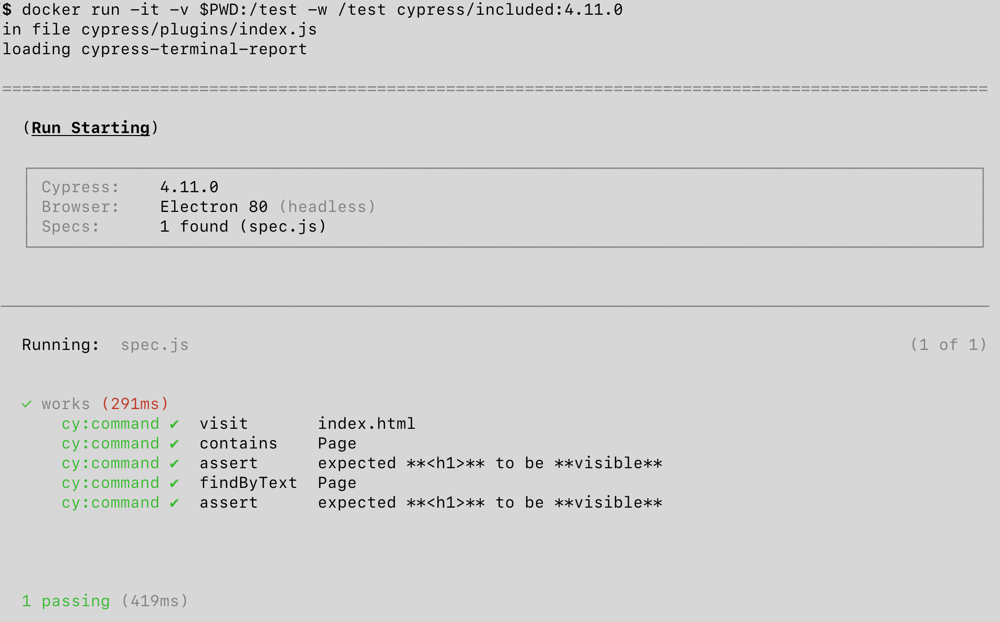

# cypress-gh-action-included 
> Example showing how to run [cypress/included Docker image][1] inside GH Actions CI

This repository contains the static page [index.html](index.html) tested by Cypress Test Runner in [cypress/integration/spec.js](cypress/integration/spec.js). There is nothing to install or start, how can we run these tests in the simplest way?

Fact: you can run Cypress tests locally without installing dependencies

```shell
docker run -it -v $PWD:/test -w /test cypress/included:3.8.3
```

Then: run the same on GH Actions CI. See [.github/workflows/included.yml](.github/workflows/included.yml), but in general

```yml
name: included
on: [push]
jobs:
  cypress-run:
    runs-on: ubuntu-latest
    # Docker image with Cypress pre-installed
    # https://github.com/cypress-io/cypress-docker-images/tree/master/included
    container: cypress/included:4.11.0
    steps:
      - uses: actions/checkout@v1
      - run: cypress run
```

[1]: https://github.com/cypress-io/cypress-docker-images/tree/master/included

## Local plugins

This repo also shows that you can install additional NPM modules and load them from globally installed Cypress. For example, the tests use [cypress-testing-library](https://github.com/testing-library/cypress-testing-library) and [cypress-terminal-report](https://github.com/archfz/cypress-terminal-report)



Which is why on CI we need to run `npm ci` to install them.
